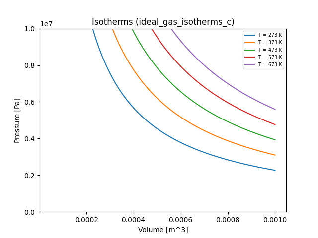
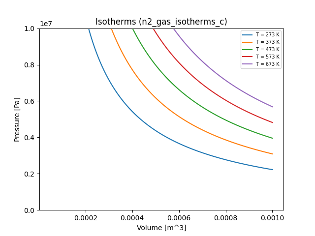
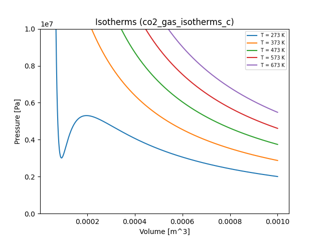

# Examples

All of the examples in this section use the **Van der Waals gas law**, a
generalization of the ideal gas law that accurately describes many gases over
a great range of temperatures, pressures, and volumes.

All examples use the Standard International (SI, also called *mks*) system of
units. When we define a quantity, we denote its units in square brackets. For
example, the mass of an object could be written as $m$ [kg]. Quantities without
units are followed by [-].

The code for these examples is available in the
[examples folder](https://github.com/eagles-project/skywalker/tree/main/examples)
of the Skywalker source tree.

### Ideal gas

Recall that the ideal gas law relates the pressure, temperature, and volume of
a gas through the equation of state

$$
pV = \nu R T
$$

where

* $p$ is the gas pressure [Pa]
* $V$ is the volume occupied by the gas [m$^3$]
* $\nu$ is the number of moles of gas contained in the volume $V$ [-]
* $R$ is the universal gas constant [J $\cdot$ K$^{-1} \cdot$ mol$^{-1}$]
* $T$ is the temperature of the gas [K]

Strictly speaking, the ideal gas law holds for gases whose molecules don't
interact with one another. While this is not true for any known substance, it's
a good approximation for gases whose molecules interact only weakly.

### Van der Waals gas

The equation of state for the van der Waals gas law is a refinement of the ideal
gas law that attempts to model weak interactions between particles using a pair
of parameters $a$ and $b$. The equation is

$$
(p + a/V^2)(V - b) = \nu RT
$$

where $a$ represents the effects of **cohesive forces** within a molecule, and
$b$ represents effects of molecules having a **finite size**. Clearly, when
$a=b=0$, this equation reverts to the ideal gas law.

The Van der Waals approximation is a significant improvement on the ideal gas
law, and can be used to study various phenomena. Our discussion follows that in
Chapter IV of *Thermodynamics*, by Enrico Fermi, Dover Publications, NY (1936).

## Example 1: Plotting Isotherms

An isotherm is a thermodynamic process in which the temperature remains the
same throughout. Isothermal processes are important in any setting in which
smaller physical systems interact with a heat reservoir at a given temperature.
They are conveniently expressed using **PV diagrams**, which are just XY plots
with the volume $V$ on the $x$ axis and the pressure $p$ on the $y$ axis.

### Ideal gas

We can construct an isotherm curve for an ideal gas by writing the pressure $p$
as a function of $V$ and $T$ for a single mole of gas ($\nu = 1$):

$$
p(V, T) = \frac{RT}{V}
$$

Let's write a simple Skywalker program that takes $V$ and $T$ as input and
computes $p$ as output. Our program will read the following input file, named
`ideal_gas_isotherms`, which constructs an ensemble of $(V, T)$ pairs,
with $V \in [5^{-5}, 1^{-3}]$ m${^3}$ and $T$ assuming the values 273 K, 373 K,
473 K, 573 K, and 673 K.

=== "ideal_gas_isotherms.yaml"
    ```
    type: lattice

    input:
      V: [5.0e-5, 1.0e-3, 1.0e-6]  # [m^3]
      T: [273, 373, 473, 573, 673] # [K]
    ```

Here's our program:

=== "C"

    ``` c linenums="1"
    // isotherms.c
    #include <skywalker.h>

    // This function retrieves the value with the given name from the given
    // input, exiting on failure.
    sw_real_t get_value(sw_input_t *input, const char *name) {
      sw_input_result_t in_result = sw_input_get(input, name);
      if (in_result.error_code != SW_SUCCESS) {
        fprintf(stderr, "isotherms_c: %s", in_result.error_message);
        exit(-1);
      }
      return in_result.value;
    }

    // Here's the main function.
    int main(int argc, char **argv) {
      const char *input_file = "ideal_gas_isotherms.yaml";

      // Load the ensemble. Any error encountered is fatal.
      printf("isotherms_c: Loading ensemble from %s...\n", input_file);
      sw_ensemble_result_t load_result = sw_load_ensemble(input_file, NULL);
      if (load_result.error_code != SW_SUCCESS) {
        fprintf(stderr, "isotherms_c: %s", load_result.error_message);
        exit(-1);
      }

      sw_ensemble_t *ensemble = load_result.ensemble;
      printf("isotherms_c: found %zd ensemble members.\n", sw_ensemble_size(ensemble));

      // Iterate over all members of the ensemble.
      sw_input_t *input;
      sw_output_t *output;
      while (sw_ensemble_next(ensemble, &input, &output)) {
        // Fetch (V, T) from the member's input.
        sw_real_t V = get_value(input, "V"); // gas (molar) volume [m3]
        sw_real_t T = get_value(input, "T"); // gas temperature [K]

        // Compute p(V, T).
        static const sw_real_t R = 8.31446261815324;
        sw_real_t p = R * T / V;

        // Stash the computed pressure in the member's output.
        sw_output_set(output, "p", p);
      }

      // Write out a Python module.
      const char *output_file = "ideal_gas_isotherms_c.py";
      printf("isotherms_c: Writing data to %s...\n", output_file);
      sw_write_result_t w_result = sw_ensemble_write(ensemble, output_file);
      if (w_result.error_code != SW_SUCCESS) {
        fprintf(stderr, "isotherms_c: %s\n", w_result.error_message);
        exit(-1);
      }

      // Clean up.
      sw_ensemble_free(ensemble);
    }
    ```

=== "C++"

    ``` c++ linenums="1"
    // isotherms.cpp
    #include <skywalker.hpp>

    int main(int argc, char **argv) {
      std::string input_file = "ideal_gas_isotherms.yaml";

      // Load the ensemble. Any error encountered is fatal.
      std::cout << "isotherms_cpp: Loading ensemble from " << input_file << "...\n";
      skywalker::Ensemble *ensemble = nullptr;
      try {
        ensemble = skywalker::load_ensemble(input_file);
      } catch (skywalker::Exception &e) {
        std::cerr << "isotherms_cpp: " << e.what() << std::endl;
        exit(-1);
      }
      std::cout << "isotherms_cpp: found " << ensemble->size() << " ensemble members.\n";

      // Iterate over all members of the ensemble.
      try {
        ensemble->process([](const skywalker::Input &input,
                             skywalker::Output &output) {
          // Fetch inputs.
          skywalker::Real V = input.get("V"); // gas (molar) volume [m3]
          skywalker::Real T = input.get("T"); // gas temperature [K]

          // Compute p(V, T).
          static const skywalker::Real R = 8.31446261815324;
          skywalker::Real p = R * T / V;

          // Stash the computed pressure in the member's output.
          output.set("p", p);
        });
      } catch (skywalker::Exception &e) {
        std::cerr << "isotherms_cpp: " << e.what() << "\n";
        exit(-1);
      }

      // Write out a Python module.
      std::string output_file = "ideal_gas_isotherms_cpp.py";
      std::cout << "isotherms_cpp: Writing data to " << output_file << "...\n";
      try {
        ensemble->write(output_file);
      } catch (skywalker::Exception &e) {
        std::cerr << "isotherms_cpp: " << e.what() << "\n";
        exit(-1);
      }

      // Clean up.
      delete ensemble;
    }
    ```

=== "Fortran"

    ``` fortran linenums="1"
    ! isotherms.F90
    program isotherms
      use iso_c_binding, only: c_float, c_double
      use skywalker
      implicit none

      ! Working precision real kind
      integer, parameter :: wp = c_real

      ! Universal gas constant
      real(wp), parameter     :: R = 8.31446261815324_wp

      character(len=255)      :: input_file, output_file
      type(ensemble_result_t) :: load_result
      type(ensemble_t)        :: ensemble
      type(input_t)           :: input
      type(output_t)          :: output
      real(wp)                :: V, T, p, a, b

      input_file = "ideal_gas_isotherms.yaml"

      ! Load the ensemble. Any error encountered is fatal.
      print *, "isotherms_f90: Loading ensemble from ", trim(input_file), "..."
      load_result = load_ensemble(trim(input_file))
      if (load_result%error_code /= SW_SUCCESS) then
        print *, "isotherms_f90: ", trim(load_result%error_message)
        stop
      end if

      ensemble = load_result%ensemble
      print *, "isotherms_f90: found ", ensemble%size, " ensemble members."

      ! Iterate over all members of the ensemble.
      do while (ensemble%next(input, output))
        ! Fetch inputs.
        V = input%get("V") ! gas (molar) volume [m3]
        T = input%get("T") ! gas temperature [K]

        ! Compute p(V, T).
        p = R * T / V

        ! Stash the computed pressure in the member's output.
        call output%set("p", p);
      end do

      ! Write out a Python module.
      output_file = "ideal_gas_isotherms_f90.py"
      print *, "isotherms_f90: Writing data to ", output_file, "..."
      call ensemble%write(output_file)

      ! Clean up.
      call ensemble%free();
    end program
    ```

Click through the different tabs for the C, C++, and Fortran versions of the
program. You can see that they're very similar. Here's what's going on:

1. An ensemble is loaded with a `load_ensemble` function. If the attempt to
   load the ensemble fails, the program halts.
2. The members of the ensemble are processed one by one. In the C and Fortran
   programs, this happens in a `while`/`do while` loop, in which a call to
   `sw_ensemble_next` or `ensemble%next` associates the `input` and `output`
   variables with a specific ensemble member. In C++, this loop is hidden inside
   a call to `ensemble->process`, which accepts a lambda function whose
   arguments are the properly associated `input` and `output` variables for each
   member. Inside this loop:
    1. the gas volume $V$ and temperature $T$ are extracted from the `input`
       variable for the current ensemble member
    2. the gas pressure $p$ is computed from $V$ and $T$
    3. the computed pressure $p$ is stored in the `output` variable for the
       current ensemble member
3. After every ensemble member has been processed in Step 2, a Python module
   containing all input and output data for the ensemble is written.
4. The ensemble is deleted with an appropriate function call or command.

For a more detailed explanation of any of these steps, see the [API](api.md)
section.

If you like, copy and paste any version of the program into a text editor, save
it, and build it, linking it against `libskywalker.a` or `libskywalker_f90.a`
as needed. Then run it in a directory containing `ideal_gas_isotherms.yaml`,
and check to see that an appropriate `.py` file appears.

Here's a plot of the resulting isotherms:



If you want to generate this plot for yourself, run the
[plot_isotherms.py](https://github.com/eagles-project/skywalker/tree/main/examples/plot_isotherms.py)
script in the `examples/` folder of the repo on the appropriate `.py` file,
leaving out the `.py` suffix. E.g.

```
python3 plot_isotherms.py ideal_gas_isotherms_c
```

### Van der Waals gases

Now that we've successfully used Skywalker to plot the isotherms of an ideal
gas at several temperatures, we can generalize our program(s) to handle Van der
Waals gases. All we need to do is add the two parameters $a$ and $b$ as input.
Here's a YAML input file that sets these parameters for diatomic nitrogen gas:

=== "n2_gas_isotherms.yaml"
    ```
    type: lattice

    input:
      V: [5.0e-5, 1.0e-3, 1.0e-6]  # [m^3]
      T: [273, 373, 473, 573, 673] # [K]
      a: 0.137                     # [Pa m6/mol2]
      b: 3.87e-5                   # [m3/mol]
    ```

And here's one for carbon dioxide:

=== "co2_gas_isotherms.yaml"
    ```
    type: lattice

    input:
      V: [5.0e-5, 1.0e-3, 1.0e-6]  # [m3]
      T: [273, 373, 473, 573, 673] # [K]
      a: 0.3658                    # [J m3/mol2]
      b: 4.29e-5                   # [m3/mol]
    ```

Now we must modify our programs to include these input parameters in the
calculation of the gas pressure. Here are code snippets that implement these
changes:

=== "C"
    Replace lines 38-40 with
    ``` c linenums="38"
        // Fetch Van der Waals parameters if they're present.
        sw_real_t a = 0.0, b = 0.0;
        if (sw_input_has(input, "a")) {
          a = get_value(input, "a");
        }
        if (sw_input_has(input, "b")) {
          b = get_value(input, "b");
        }

        // Compute p(V, T).
        static const sw_real_t R = 8.31446261815324;
        sw_real_t p = R * T / (V - b) - a/(V*V);

    ```
=== "C++"
    Replace lines 26-28 with
    ``` c++ linenums="26"
          // Fetch Van der Waals parameters if they're present.
          skywalker::Real a = 0.0, b = 0.0;
          if (input.has("a")) {
            a = input.get("a");
          }
          if (input.has("b")) {
            b = input.get("b");
          }

          // Compute p(V, T).
          static const skywalker::Real R = 8.31446261815324;
          skywalker::Real p = R * T / (V - b) - a/(V*V);
    ```
=== "Fortran"
    Declare `real(wp)` variables `a` and `b`, and replace lines 39-40 with
    ``` fortran linenums="39"
        ! Fetch Van der Waals parameters if they're present.
        a = 0.0_wp
        b = 0.0_wp
        if (input%has("a")) a = input%get("a")
        if (input%has("b")) b = input%get("b")

        ! Compute p(V, T).
        p = R * T / (V - b) - a/(V**2)
    ```

With these changes, the program can now build the ensembles indicated in the
`n2_gas_isotherms.yaml` and `co2_gas_isotherms.yaml` files. Here's the resulting
plot for nitrogen:



And for carbon dioxide:



## Example 2: Vapor Saturation Pressure in Carbon Dioxide Gas

If you are familiar with thermodynamics, you may be alarmed at the blue curve
representing the isotherm for $T = 273$ K for carbon dioxide. If you follow the
curve starting from the right, the process represents the compression of the gas
at a constant temperature. Somewhere around $V = 2 \times 10^{-4}$ m$^3$, something
funny happens: the gas pressure *decreases* under compression. This simply
doesn't happen in reality. What's going on?

What's happening is a phase change: carbon dioxide condenses to liquid form
under these conditions. Therefore the gas is no longer in a homogeneous state,
and the Van der Waals equation of state isn't satisfied for the gas/liquid
mixture. Rather, the pressure (called the **saturation vapor pressure**) remains
constant alongside the temperature over the course of the phase change. One way
to understand this is that under a phase change, the system reconfigures itself
in a way taht affects its binding energy and not its kinetic energy, and the
pressure in a Van der Waals gas only depends on its kinetic energy.

In other words, the saturation vapor pressure is a horizontal line over the
course of the phase change. It looks like this:


Let's modify our program to make use of these ideas. One might think that
we must compute the saturation vapor pressure using the Clapeyron equation,
which involves the latent heat of evaporation and the specific volumes of the
gas and liquid phases. However, all we really need to know is that the entropy
of a system $S$ remains unchanged over a complete cycle in a reversible process
(such as a phase change):

$$
\oint \texttt{d}S = \oint \frac{\texttt{d}Q}{T} = 0
$$

where $\texttt{d}Q$ is the increment (differential) of the heat $Q$. In an
isothermal process, $T$ is constant, and we are left with the statement
that the **total heat exchanged in a complete cycle of a reversible isothermal
process is 0**.

*Discuss the calculation of the saturation vapor pressure here.*

Before we move on, we note that the gas pressure can actually exceed the
saturation vapor pressure in a supersaturated liquid. The Van der Waals equation
of state does a decent job of illustrating this phenomenon. We take this up in
the next example.

## Example 3: A Parameter Study Using Latin Hypercube Sampling

